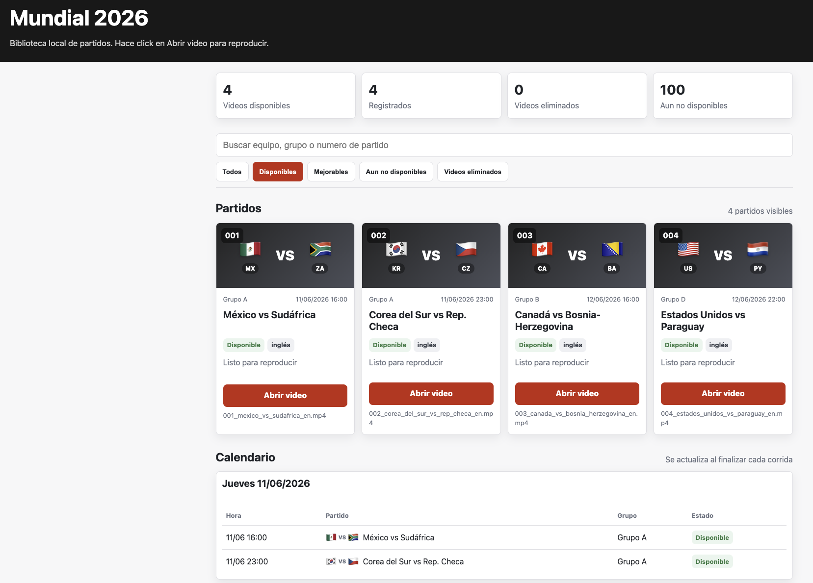

# ⚽ Descargador Mundial 2026



## Aviso Legal

Este proyecto es una herramienta de automatización con fines educativos, técnicos y de uso
personal. El script no aloja, no vende, no publica y no distribuye contenido audiovisual.
Solo automatiza búsquedas, organización local, reintentos y descargas a partir de fuentes
configuradas por el usuario.

Los partidos, transmisiones, relatos, logos, nombres comerciales y materiales asociados al
Mundial pueden estar protegidos por derechos de autor, derechos de transmisión, marcas u
otras restricciones legales. Cada usuario es responsable de verificar que tiene permiso,
licencia o derecho de acceso para descargar, grabar, copiar o conservar cualquier contenido
que use con este proyecto.

Agregar este aviso no autoriza el uso de fuentes no permitidas ni reemplaza asesoramiento
legal. Si una fuente no permite descarga, copia, redistribución o conservación local, no
debería usarse con este script.

---

## Qué es

Scripts en Python para organizar la búsqueda, descarga y archivo automático de los 104
partidos del Mundial FIFA 2026. Está probado principalmente en macOS; el núcleo Python es
portable y puede adaptarse a Linux o Windows revisando los puntos de
[`docs/plataformas.md`](docs/plataformas.md).

El sistema busca partidos ya finalizados en fuentes torrent configuradas por el usuario,
los descarga vía qBittorrent y los organiza automáticamente en carpetas por fase y grupo.

## Cómo funciona

```
┌──────────────────────────────────────────────────────────────────────┐
│  launchd / cron / Task Scheduler (cada 30 min)                      │
│      └── descargar_partidos.py (orquestador)                        │
│              ├── config.py + .env                                   │
│              ├── calendario_mundial_2026.json (104 partidos)        │
│              ├── estado_descargas.py ──► estado_descargas.json      │
│              │       └── historial sin depender de archivos locales │
│              ├── ¿Partido terminó hace +3 horas? ──► buscar         │
│              ├── buscador_torrents.py (fachada + ranking final)     │
│              │       ├── busqueda_reglas.py                         │
│              │       ├── fuentes_manuales.py + JSON manual          │
│              │       ├── fuentes_torrent.py + JSON de mirrors       │
│              │       ├── fallback_ytdlp.py                          │
│              │       └── groq_asistente.py (opcional)               │
│              ├── qbit_manager.py ──► qBittorrent Web API            │
│              ├── organizador_descargas.py ──► mueve torrents 100%   │
│              ├── verificador_archivos.py                            │
│              │       ├── idioma_utils.py                            │
│              │       └── nombres_archivos.py                        │
│              ├── postprocesador_web.py ──► MP4 + audio AAC para HTML │
│              ├── reporte_diario.py                                  │
│              ├── indice_biblioteca.py                               │
│              └── ~/Desktop/Mundial_Partidos/                        │
│                      ├── Fase_de_Grupos/Grupo_A/                    │
│                      ├── Fase_de_Grupos/Grupo_B/                    │
│                      ├── ...                                        │
│                      ├── Octavos_de_Final/                          │
│                      ├── Cuartos_de_Final/                          │
│                      ├── Semifinales/                               │
│                      └── Final/                                     │
└──────────────────────────────────────────────────────────────────────┘
```

## Lectura rápida

- Busca partidos que ya empezaron hace al menos 3 horas.
- Prioriza español, partido completo, 720p y tamaños razonables.
- Mantiene historial en `estado_descargas.json`, independiente de archivos locales.
- Si una descarga está en inglés queda `MEJORABLE`; si está en español queda `FINAL`.
- Genera MP4 para Chrome: remux si el archivo es razonable, transcode 720p/30fps si pesa mas de 5 GB.
- `yt-dlp` existe solo como fallback tardío y validado.

Detalle de reglas, idioma, historial, nombres, postproceso y reportes:
[`docs/funcionamiento.md`](docs/funcionamiento.md).

## Instalación

### Requisitos

- Python 3.10+
- [qBittorrent](https://www.qbittorrent.org/) instalado
- `ffmpeg`/`ffprobe` para metadata y MP4 compatible con navegador
- Git (para clonar el repo)

### Paso a paso

```bash
# 1. Clonar el repositorio
git clone https://github.com/jdfesa/mundial-2026.git
cd mundial-2026

# 2. Crear entorno virtual e instalar dependencias
python3 -m venv venv
source venv/bin/activate        # En Windows: venv\Scripts\activate
pip install -r requirements.txt

# 3. Configurar datos locales
cp .env.example .env
cp fuentes_torrent.example.json fuentes_torrent.json
cp fuentes_manuales.example.json fuentes_manuales.json

# 4. Editar .env con tu ruta de descarga y credenciales de qBittorrent
# 5. Editar fuentes_torrent.json con mirrors funcionales
```

Los archivos locales ignorados por git estan explicados en
[`docs/archivos-locales.md`](docs/archivos-locales.md).
El alcance por sistema operativo esta resumido en
[`docs/plataformas.md`](docs/plataformas.md).

### Setup automático (macOS)

```bash
chmod +x setup.sh
bash setup.sh
```

Esto crea el entorno, instala dependencias, genera las carpetas de destino e instala
la tarea de launchd para ejecución automática cada 30 minutos.

### Setup automático (Windows)

```bat
run_windows.bat --dry-run
install_windows_task.bat
```

## Configuración

El proyecto usa tres archivos locales principales:

- `.env`: rutas, qBittorrent, Groq opcional y parametros de fallback.
- `fuentes_torrent.json`: mirrors reales de indexadores.
- `fuentes_manuales.json`: URLs especificas que tengas permiso de descargar.

Los templates versionados son `.env.example`, `fuentes_torrent.example.json` y
`fuentes_manuales.example.json`. Para ver que archivos se generan solos y por que no se
suben, lee [`docs/archivos-locales.md`](docs/archivos-locales.md).

## Uso

### macOS / Linux manual

Uso recomendado con menu interactivo:

```bash
./menu.sh
```

El menu permite ver estado, ejecutar, simular, forzar un partido, marcar descargas,
probar qBittorrent y, en macOS, reinstalar la tarea automatica con launchd.

```bash
./run.sh                   # Ejecutar
./run.sh --dry-run         # Simular sin descargar
./run.sh --status          # Ver estado de descargas
./run.sh --forzar 3        # Forzar descarga del partido #3
./run.sh --solo-manuales   # Solo fuentes manuales
./run.sh --postprocesar-web # Preparar MP4/AAC sin buscar descargas nuevas
./run.sh --auditar-biblioteca # Detectar rutas/IDs inconsistentes
./run.sh --sanear-biblioteca --dry-run # Simular saneamiento local de rutas/estado
./run.sh --marcar-descargado 1 --idioma en --archivo "Titulo visto en qBittorrent"
```

En Linux no hay instalador incluido; si queres automatizar, agregá un cron o systemd timer
que ejecute `./run.sh`. Detalles: [`docs/plataformas.md`](docs/plataformas.md).

### Windows

```bat
run_windows.bat --dry-run
run_windows.bat --status
run_windows.bat --forzar 3
run_windows.bat --marcar-descargado 1 --idioma en --archivo "Titulo visto en qBittorrent"
```

### Directo con Python

```bash
python descargar_partidos.py --status
python descargar_partidos.py --dry-run
python descargar_partidos.py --forzar 1
python descargar_partidos.py --marcar-descargado 1 --idioma es --archivo "Mexico vs Sudafrica español"
```

`--marcar-descargado` sirve para rectificar el estado cuando ya viste que un partido está
descargado o en cola. Si lo marcás con `--idioma en`, queda como `MEJORABLE`; si lo marcás
con `--idioma es`, queda como `FINAL`.

## Documentación

- [`docs/funcionamiento.md`](docs/funcionamiento.md): reglas de búsqueda, idioma,
  historial, nombres, postproceso y reportes.
- [`docs/archivos-locales.md`](docs/archivos-locales.md): archivos ignorados, generados y
  configuración local.
- [`docs/plataformas.md`](docs/plataformas.md): qué está probado y qué revisar en macOS,
  Linux o Windows.
- [`docs/qbittorrent.md`](docs/qbittorrent.md): Web API, credenciales y diagnóstico de
  qBittorrent.
- [`docs/estructura.md`](docs/estructura.md): carpetas generadas e inventario de archivos.

## qBittorrent

El script usa qBittorrent Web API como integración principal. La configuración esperada por
defecto es `127.0.0.1:8080` con las credenciales de `.env`. En `--status` no abre apps: solo
consulta la API.

Guía completa: [`docs/qbittorrent.md`](docs/qbittorrent.md).

## Repos útiles

- [debatepro/world-cup-2026-calendar](https://github.com/debatepro/world-cup-2026-calendar) — JSON/CSV/ICS con `kickoff_utc`, estadio, ciudad. CC0/MIT.
- [openfootball/worldcup.json](https://github.com/openfootball/worldcup.json) — Fixtures, equipos, grupos, resultados. CC0.
- [mjwebmaster/world-cup-2026-schedule-data](https://github.com/mjwebmaster/world-cup-2026-schedule-data) — JSON/CSV/ICS alternativo.
