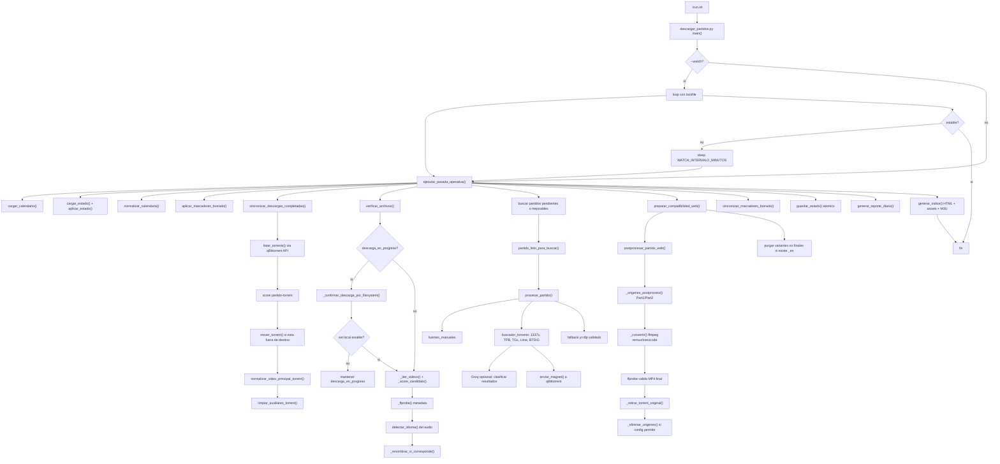

# Funcionamiento

Este documento concentra las reglas operativas del descargador: cuando busca, como decide
que descargar, como maneja idioma, historial, verificacion local y postproceso.

## Diagrama De Flujo



## Logica De Busqueda

El script revisa el calendario y solo procesa partidos que:

- ya hayan empezado hace al menos 3 horas;
- no esten descargados en idioma final;
- no hayan superado el maximo de intentos normales;
- respeten el tiempo entre reintentos.

Para cada partido genera queries en ingles y espanol, en ambos ordenes:

```text
Mexico vs South Africa
South Africa vs Mexico
Mexico vs Sudafrica
Sudafrica vs Mexico
```

Busca primero en fuentes manuales y luego en los indexadores configurados en
`fuentes_torrent.json`. Si no encuentra nada, `yt-dlp` queda reservado como fallback tardio
y validado.

Si `GROQ_HABILITADO=1`, Groq puede sumar queries de busqueda y ajustar la puntuacion de
resultados ya encontrados. No agrega URLs por su cuenta ni salta las fuentes configuradas.

## Ranking De Resultados

El mejor resultado se elige por puntuacion aproximada:

- Idioma espanol: +100 puntos
- Partido completo: +50
- Calidad 720p: +30
- Seeders: hasta +40
- Tamano ideal, entre 1.5 GB y 5 GB: +15
- Keywords del mundial: +10

El objetivo es priorizar partido completo, idioma espanol, 720p razonable y tamano esperable
sin gastar CPU en recomprimir por defecto.

## Fallback yt-dlp

El fallback `yt-dlp` espera bastante mas que los torrents antes de activarse
(`YTDLP_HORAS_ESPERA_POST_PARTIDO`, por defecto 24 horas desde el inicio del partido).

Antes de descargar, revisa metadata:

- ambos equipos deben aparecer en el titulo;
- debe haber senal de partido completo o replay;
- no puede contener palabras de comentario, reaccion o resumen;
- debe durar entre 90 y 180 minutos;
- debe tener al menos 720p.

Si un archivo descargado por `yt-dlp` no pasa esa validacion local, queda como `rechazado`
y el partido vuelve a pendiente.

## Logica De Idioma

| Idioma detectado | Estado | Sigue buscando |
|------------------|--------|----------------|
| Espanol | `FINAL` | No, ya tiene la version preferida. |
| Ingles | `MEJORABLE` | Si, pero solo si encuentra una en espanol. |
| Otro idioma conocido | `MEJORABLE` | Si, pero solo si encuentra una en espanol. |
| Desconocido | `MEJORABLE` | Si, igual que ingles/otros idiomas. |

Si un partido ya esta en ingles, ruso, bulgaro u otro idioma no final, y una busqueda
posterior encuentra otro resultado no final, no se vuelve a descargar. Si encuentra una
version en espanol, se descarga y el partido pasa a estado final.

El `id` del calendario no se recalcula por posicion ni por archivos presentes. Funciona como
identidad estable del partido: si `005` fue Qatar vs Suiza, cualquier variante de idioma usa
ese mismo prefijo. El sufijo (`_es`, `_en`, `_rus`, `_bul`, etc.) diferencia variantes
fisicas sin cambiar el ID.

Cuando una version en espanol queda disponible y compatible para la web, el flujo puede purgar
archivos canonicos no finales del mismo ID (`005_..._en.*`, `005_..._bul.*`, etc.) para
recuperar espacio. Esto se controla con `PURGAR_INGLES_AL_FINAL_ES`.

Las busquedas de mejora para partidos ya descargados en ingles no consumen los intentos
normales. Se registran aparte como `intentos_mejora` y `ultimo_intento_mejora`, y se
reintentan segun `MINUTOS_ENTRE_REINTENTOS_MEJORA`.

## Historial Y Verificacion Local

El historico operativo vive en `estado_descargas.json`. Ese archivo es la verdad que usa el
script para saber que partidos ya fueron descargados, cuales son finales y cuales siguen
siendo mejorables.

La biblioteca local solo se usa como verificacion complementaria. Si moves o borras un
archivo de esta computadora despues de pasarlo a otra PC, el partido no vuelve a pendiente:
queda como historico descargado en el estado persistente.

Cuando el script detecta que un partido registrado ya no tiene video local, puede crear un
marcador junto a la carpeta esperada:

```text
001_mexico_vs_sudafrica_en_BORRADO.txt
```

Ese marcador reserva el ID, evita redescargas automaticas y permite que la web muestre
`Video no encontrado` en lugar de un link roto.

En cada `--status` y al final de una ejecucion real, el script revisa la biblioteca local:

- busca archivos de video en `DIRECTORIO_BASE`;
- tambien revisa la ruta guardada del partido si existe;
- opcionalmente revisa rutas extra configuradas en `MUNDIAL_DIRECTORIOS_EXTRA`;
- si encuentra un video, guarda metadata local;
- si ya no encuentra el video, conserva `archivo_local_ultimo` y marca
  `archivo_local_estado=movido_o_borrado`.
- si qBittorrent informa progreso menor a 100%, no verifica ni postprocesa archivos parciales.
- si existe o corresponde un marcador `*_BORRADO.txt`, lo respeta como historial local.
- si qBittorrent no responde pero el video canonico y sus partes relacionadas estan en
  disco, tienen metadata legible, no tienen extensiones incompletas y llevan varios minutos
  sin modificarse, el verificador puede marcarlas como completas por filesystem para no
  quedar bloqueado por un estado viejo de la API.

Para leer duracion, resolucion e idioma de pistas de audio usa `ffprobe` si esta instalado.
Si no esta, igual detecta existencia y tamano.

## Nombres Y Postproceso

Los archivos completos se renombran a un formato estable cuando el script puede hacerlo de
forma segura:

```text
001_mexico_vs_sudafrica_en.mkv
002_corea_del_sur_vs_rep_checa_es.mp4
005_qatar_vs_suiza_bul.mp4
```

El prefijo numerico evita colisiones, los equipos salen del calendario en espanol y el
sufijo indica idioma/estado: `_es` es final; `_en`, `_bul`, `_rus` u otros quedan como
mejorables con el mismo peso.

Si qBittorrent esta administrando el archivo, el renombrado se intenta por la Web API de
qBittorrent. Cuando el torrent trae una carpeta release con spam, el video principal se
aplana a la raiz del grupo con el nombre canonico. Para fuentes manuales o `yt-dlp`, el
renombrado puede hacerse directamente sobre el archivo.

Despues de verificar el archivo local, el flujo puede generar una copia MP4 compatible con
el reproductor del navegador. Esto esta pensado para que `index.html` funcione como una
experiencia simple tipo YouTube en Chrome:

- si el origen ya es MP4 con audio compatible, se usa tal cual;
- si el origen trae video H.264 y audio no compatible para Chrome, por ejemplo AC3 en MKV,
  se copia el video sin recomprimir y solo se convierte el audio a AAC;
- si el origen total supera 5 GB o viene por encima de 720p, se transcodifica a MP4
  H.264/AAC 720p/30fps;
- si el torrent trae Part1/Part2, se resuelven las partes desde qBittorrent y se procesan
  juntas en orden;
- si no hay espacio libre suficiente, queda `compatibilidad_web=pendiente` y se reintenta
  en una corrida futura;
- por defecto conserva el archivo original para no romper torrents que siguen seedeando.

El comando manual para preparar la biblioteca existente sin buscar descargas nuevas es:

```bash
./run.sh --postprocesar-web
```

Ese comando no termina solo en la conversion: al finalizar vuelve a verificar metadata,
renombra el MP4 final si el idioma detectado cambia el sufijo, guarda estado, genera reporte
y regenera el indice web.

## Modo Watch

`./run.sh` hace una pasada completa y termina. Para dejar el orquestador observando el flujo
durante una ventana controlada existe:

```bash
./run.sh --watch
```

El modo watch no se llama a si mismo. Ejecuta un loop interno con lockfile para evitar dos
instancias simultaneas:

```text
mientras no venza el limite:
  ejecutar una pasada normal
  si no hay descargas activas ni postprocesos pendientes, terminar
  esperar WATCH_INTERVALO_MINUTOS
```

Valores por defecto:

```env
WATCH_MAX_MINUTOS=240
WATCH_INTERVALO_MINUTOS=30
DESCARGA_ESTIMACION_CHICA_MINUTOS=60
DESCARGA_ESTIMACION_GRANDE_MINUTOS=180
DESCARGA_ESTIMACION_UMBRAL_GRANDE_GB=5.0
```

La estimacion se guarda cuando se encola una descarga: hasta 5 GB se toma como ventana de
aprox. 1 hora; por encima de 5 GB, como aprox. 3 horas. El watch igual revisa con el intervalo
configurado para no quedar ciego si qBittorrent termina antes.

Protecciones del modo desatendido:

- cada fuente torrent tiene un timeout global para que un scraper colgado no bloquee la
  pasada completa;
- las llamadas HTTP usan timeout de conexion y lectura configurables;
- el watch libera su lock ante `SIGTERM`, `SIGINT` o interrupcion de teclado;
- `estado_descargas.json` se escribe primero a un temporal y luego se reemplaza de forma
  atomica.

Para auditar o sanear inconsistencias locales de carpetas/IDs:

```bash
./run.sh --auditar-biblioteca
./run.sh --sanear-biblioteca --dry-run
./run.sh --sanear-biblioteca
```

El saneamiento no toca descargas activas y esta pensado para casos obvios, por ejemplo un
archivo `001_...` guardado en la carpeta de otro grupo o dos partidos apuntando al mismo MP4.

Variables relacionadas:

```env
WEB_COMPAT_POSTPROCESO=1
WEB_COMPAT_AUDIO_BITRATE=192k
WEB_COMPAT_AUDIO_CHANNELS=2
WEB_COMPAT_MIN_FREE_GB=1.0
WEB_COMPAT_TRANSCODE_PESADO=1
WEB_COMPAT_TRANSCODE_UMBRAL_GB=5.0
WEB_COMPAT_TARGET_HEIGHT=720
WEB_COMPAT_TARGET_FPS=30
WEB_COMPAT_VIDEO_CRF=23
WEB_COMPAT_VIDEO_PRESET=veryfast
WEB_COMPAT_CONSERVAR_ORIGINAL=1
WEB_COMPAT_CONSERVAR_ORIGINAL_PESADO=0
WEB_COMPAT_RETIRAR_TORRENT_ORIGINAL=1
WEB_COMPAT_ELIMINAR_ORIGINAL_SIN_QBIT=1
PURGAR_INGLES_AL_FINAL_ES=1
DESCARGA_CONFIRMAR_COMPLETA_POR_FILESYSTEM=1
DESCARGA_FILESYSTEM_MINUTOS_ESTABLE=10
```

`WEB_COMPAT_CONSERVAR_ORIGINAL=0` elimina el origen despues de generar el MP4, pero puede
dejar qBittorrent con archivos faltantes si el torrent seguia activo. Con
`WEB_COMPAT_RETIRAR_TORRENT_ORIGINAL=1`, el flujo intenta retirar primero el torrent de
qBittorrent sin pedirle que borre archivos, y luego elimina los origenes ya reemplazados
por el MP4 final. Para transcodes pesados, `WEB_COMPAT_CONSERVAR_ORIGINAL_PESADO=0`
aplica esa limpieza aunque el remux normal conserve origenes. Usalo solo si ya no necesitas
seedear ese torrent.
Si qBittorrent no responde y `WEB_COMPAT_ELIMINAR_ORIGINAL_SIN_QBIT=1`, el sistema elimina
igual los origenes dentro de `DIRECTORIO_BASE` despues de generar un MP4 compatible. Esto
privilegia liberar espacio local y puede dejar el torrent roto si se vuelve a abrir luego.

Ademas se conserva una evaluacion de tamano/resolucion:

- hasta 5 GB y 720p o menos: `mantener_origen`;
- mas de 5 GB o por encima de 720p: `transcode_720p`.

## Sincronizacion Con qBittorrent

Cuando una descarga se encola, el estado guarda `descarga_iniciada_en`,
`revisar_descarga_despues_de` y `torrent_hash` si esta disponible.

La revision de una hora es una referencia: cada corrida consulta qBittorrent y solo
mueve/renombra/verifica cuando el progreso real esta completo.

Si qBittorrent esta corriendo y la Web API responde, tambien sincroniza torrents completos:

- detecta torrents ya completados;
- los compara contra el calendario/estado por titulo y equipos;
- si estan en la carpeta por defecto de qBittorrent, le pide a qBittorrent que los mueva al
  destino final por fase/grupo;
- renombra el video principal al formato canonico en la raiz del grupo;
- opcionalmente limpia auxiliares pequenos de spam (`.nfo`, `.txt`, `.url`);
- genera MP4/AAC para el indice HTML cuando el audio del origen no es compatible con
  navegador o cuando el archivo es pesado;
- no mueve archivos con `shutil` mientras qBittorrent los administra.

Esto se controla con:

```env
QBIT_MOVER_COMPLETADOS=1
QBIT_BUSCAR_TODAS_LAS_DESCARGAS=1
MUNDIAL_RENOMBRAR_ARCHIVOS=1
QBIT_LIMPIAR_AUXILIARES=1
```

## Reportes Generados

Tambien se generan:

```text
estado_partidos.txt
reporte_diario.txt
<DIRECTORIO_BASE>/index.html
<DIRECTORIO_BASE>/playlist_mundial.m3u
```

El indice HTML permite abrir los partidos descargados desde una pagina simple, agrupados por
grupo/fase. La playlist M3U sirve para abrir todo desde VLC u otro reproductor compatible.

La zona horaria del reporte diario se puede cambiar con:

```env
MUNDIAL_ZONA_HORARIA=America/Argentina/Buenos_Aires
```
